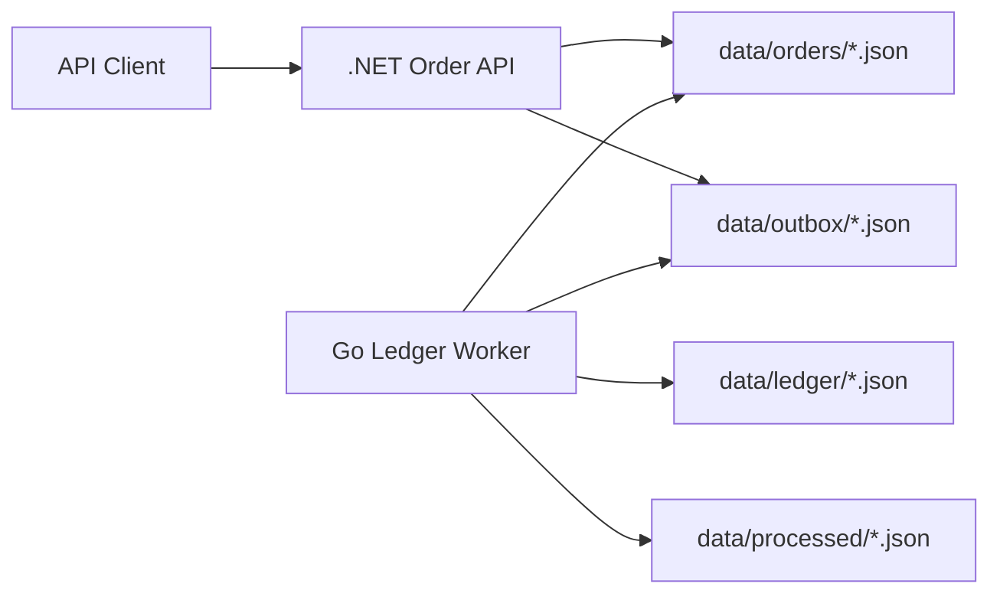

# Mixed Order Ledger System

A mixed-language backend portfolio project: an ASP.NET Core API accepts orders and writes durable outbox events, while a Go worker consumes those events, completes orders, and writes ledger entries.

The system demonstrates event-driven backend design without requiring Docker, Kafka, RabbitMQ, or cloud services. It uses file-backed JSON storage so the full flow can run locally and be inspected easily.

## Architecture



## Features

- ASP.NET Core order API
- Idempotent order creation through `Idempotency-Key`
- Durable outbox event files
- Go worker that processes `OrderCreated` events
- Ledger entries for payment capture and revenue recognition
- Idempotent worker behavior
- Shared JSON contract example
- .NET integration tests
- Go worker tests
- GitHub Actions CI for both stacks

## Run Locally

Start the API:

```bash
dotnet run --project src/OrderLedger.Api/OrderLedger.Api.csproj --urls http://localhost:5207
```

Build the worker:

```bash
cd worker
go build -o bin/ledger-worker ./cmd/ledger-worker
cd ..
```

Run the end-to-end verifier:

```powershell
.\scripts\verify-local.ps1
```

The verifier creates a fictional order, runs the worker once, and confirms the API reports completed ledger state.

## Endpoints

```text
GET  /health
GET  /api/orders
POST /api/orders
GET  /api/orders/{id}
GET  /api/orders/{id}/ledger
GET  /api/outbox
```

## Tests

Run .NET tests:

```bash
dotnet test
```

Run Go tests:

```bash
cd worker
go test ./...
```

## Why This Is Portfolio-Relevant

This project gives interview material around:

- cross-language contracts
- event-driven design
- outbox pattern basics
- idempotency
- failure recovery
- worker processing
- testing distributed-ish behavior locally
